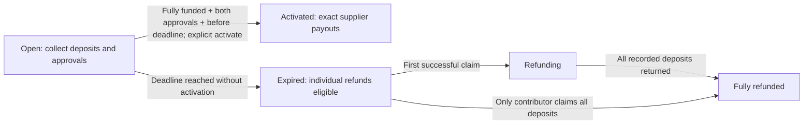

# FUSE escrow foundation

This is an isolated Anchor proof of concept. The website still uses its independent
localStorage demo. The program is not deployed, audited, or connected to a wallet UI.

## Accounts and immutable terms

Only the classic SPL Token Program is accepted. Token-2022 and mints with a freeze
authority are rejected. Amounts are `u64` integer **base units**, not floating-point
token amounts. Tests create a zero-decimal, valueless test mint, so 20 base units
means 20 test tokens; a future client must account for the selected mint's decimals.

| Account | Address / authority | Purpose |
| --- | --- | --- |
| Campaign | PDA: `campaign`, organizer public key, identifier as little-endian `u64` | Immutable organizer, identifier, mint, seat price/count, target, chain deadline, supplier wallet keys, and exact allocations; mutable approvals, aggregate deposits, terminal state |
| Vault | PDA: `vault`, campaign public key; owned by the Token Program | Token account for the campaign's mint; its transfer authority is the campaign PDA |
| Contribution | PDA: `contribution`, campaign public key, contributor public key | One aggregate seat/deposit record per contributor per campaign, plus the one-time refund flag |

Both supplier keys must be distinct, nonzero public keys. Each designated identity
must provide signer authorization to approve; a key that cannot sign cannot approve.
There is no financial-terms update instruction, no admin withdrawal, and no recovery key.
Reusing an organizer/identifier cannot overwrite an existing campaign. Supplier
approvals bind to that exact immutable campaign account, rather than a mutable UI
label. Workshop titles and location text are not stored by this minimal program.

Payout token accounts are supplied at activation. Their **mint and token owner must
match the campaign's immutable mint and designated supplier wallet**. A caller
cannot redirect either payout to their own wallet. Multiple token accounts owned
by the same designated wallet are acceptable; the beneficiary key cannot change.
Refund destinations must similarly belong to the signing contributor and use the
correct mint. SPL account ownership is checked in addition to its token-owner field.

## Instructions

1. `create_campaign(terms)`: organizer signs and pays account rent. Checks positive
   prices, seats and allocations, a future chain deadline, checked arithmetic, and
   allocations equal to `seat_price × required_seats`. Initializes an empty vault.
2. `approve_supplier(role)`: the designated venue or instructor signs. Repeated
   approvals, expired campaigns, and terminal campaigns are rejected.
3. `deposit(seats)`: contributor signs and pays contribution-account rent. Transfers
   `seats × seat_price` using SPL `transfer_checked`. Enforces the capacity and
   source token-account owner/mint. Repeated deposits accumulate in one record;
   failed transfers roll back both account initialization and accounting.
4. `activate()`: any signed caller can trigger the transition. Requires full
   accounted funding, both approvals, `Clock.unix_timestamp < deadline`, and an
   open campaign. The campaign PDA signs two token CPIs paying the fixed allocations.
   Success marks Activated and zeroes outstanding escrow accounting. A failure in
   either CPI rolls back the whole instruction, including the first transfer.
5. `refund()`: at `Clock.unix_timestamp >= deadline`, a signing contributor can
   reclaim their own recorded amount if the campaign never activated. Checks the
   contribution PDA/owner and recipient, transfers once, marks refunded, and reduces
   aggregate outstanding deposits. No early withdrawal or refund after activation.

Expiry is derived from the **on-chain Clock sysvar**, not a stored boolean or the
frontend's demo clock. Open-but-expired accounts cannot activate even if they were
ready earlier. Refunding and FullyRefunded are terminal for deposits/activation.
Activated seat counts remain historical; refunded seat counts track outstanding
contributions. Individual contribution amounts remain historical after a refund,
with `refunded = true` preventing reuse. No account-close instruction exists.

## Tests and local execution

The Rust integration suite uses LiteSVM with signature verification, real compiled
SBF bytecode, System Program account creation, and the actual SPL Token Program.
It creates its own test mint and disposable deterministic identities in memory.
No RPC service, wallet file, SOL purchase, or external deployment is involved.
Tests explicitly set the VM Clock sysvar and compare token-account balances.

The second-payout rollback test deliberately injects a frozen destination into the
VM as a fault fixture. Such freezing is not allowed by the mint policy at campaign
creation. This targeted fault proves rollback when the first CPI succeeds and the
second one fails; it is not an instruction exposed to users.

See the root README for pinned versions, executed commands, and verification results.
All 20 VM integration tests passed against the compiled program in this milestone.
The build/test scripts use an isolated Linux cache to avoid slow WSL builds on the
Windows filesystem. The SBF artifact is written to ignored `anchor/target/deploy/`.
`Anchor.toml` describes a local workspace; its public program ID is a VM identifier,
not evidence of a deployment or an associated signing keypair.

## Future frontend integration boundary

Keep `lib/demo-store.ts` as the demo adapter. Add a **separate**, explicit Solana
mode after local wallet integration works. No Solana frontend dependency is added
in this milestone.

| Existing UI command | Future program instruction / account read |
| --- | --- |
| Publish booking | Validate raw-unit terms; `create_campaign`; keep descriptive metadata separately |
| Supplier approval | Wallet signs `approve_supplier`; read Campaign approvals afterward |
| Commit seats | Derive Contribution/vault PDAs; `deposit`; read SPL balance and Contribution |
| Activate booking | Provide correct supplier token accounts; `activate`; re-fetch Campaign and balances |
| Claim refund | Wallet signs `refund` for its own Contribution and token destination |
| Status / personal commitments | Decode Campaign and Contribution; fetch chain time, not the simulation clock |
| Reset / advance clock | Demo only; no corresponding production program instruction |

Use generated Anchor IDL/types from the pinned program and wallet-authorized
transaction submission. Add pending, rejected, failed, and confirmed states; re-read
accounts after confirmation and recover after refresh. Never treat a local UI
balance, role selector, or simulation receipt as chain evidence. Persist an
organizer campaign identifier before sending and reconcile the PDA before retrying
creation, so refresh/retries do not create unrelated duplicate campaigns.

Future public configuration: RPC URL, network label, deployed program ID, and the
selected mint address (read from Campaign or a future allowlist). None is a secret.
No frontend private key, recovery phrase, privileged signing credential, or secret
RPC credential is needed. `.env.example` supplies only unused public placeholders;
the current website does not read it.

## Deliberate limitations

- Not audited or production-ready. These tests are evidence of specific behavior,
  not a general security guarantee or reproducible deployment verification.
- A later deployment introduces upgrade-authority governance, new program IDs,
  deployment keys, fees, and operational risks that this VM milestone does not settle.
- No wallet UI, RPC-backed adapter, deployment, generated client IDL artifact, token
  allowlist, metadata service, indexing, or multi-wallet end-to-end workflow yet.
- Deposits are locked until activation or expiry; there is no cancellation, approval
  revocation, supplier replacement, partial settlement, automatic keeper, or dispute
  process. Paying suppliers does not guarantee the physical workshop occurs.
- Anyone can send tokens directly to an SPL vault. Such unsolicited transfers do
  **not** buy seats or count toward funding. Surplus is never paid or refundable by
  this program and remains locked. Use `deposit`, never a direct token transfer.
- Accounts remain rent funded after settlement. No rent reclamation or rescue
  instruction is provided; an empty expired campaign has no refund transaction to run.
- The test mint has a mint authority for test setup. Rejecting freeze authority does
  not establish a token's value or supply integrity. Real integration needs a reviewed
  mint policy, clear display units, and tests against the exact intended token.
- Concurrent/replay behavior beyond the executed cases, public-network performance,
  cluster RPC failures, wallet compatibility, and deployment permissions need further
  integration testing and independent review before considering funds with value.

Primary references: [Anchor 0.32.1 release notes](https://www.anchor-lang.com/docs/updates/release-notes/0-32-1),
[account constraints](https://www.anchor-lang.com/docs/references/account-constraints),
[SPL transfer CPIs](https://www.anchor-lang.com/docs/tokens/basics/transfer-tokens),
and [LiteSVM testing](https://www.anchor-lang.com/docs/testing/litesvm).
